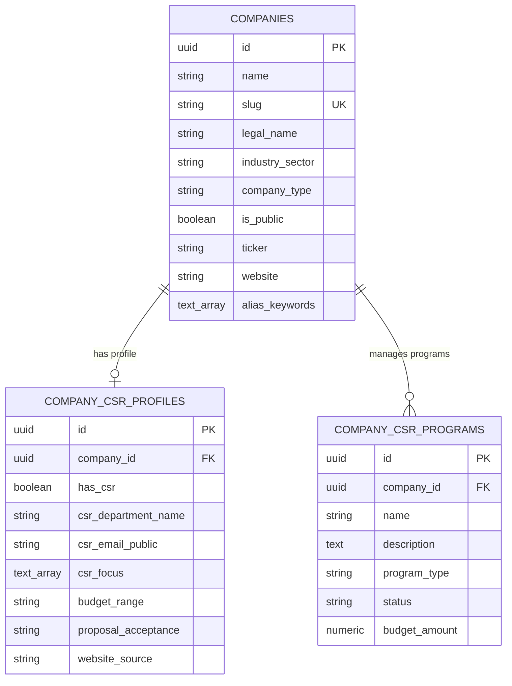

# Dokumentasi & Potensi Master Data CSR Perusahaan (Company CSR)

Dokumen ini berisi analisis komprehensif master data perusahaan (*companies*), profil Tanggung Jawab Sosial dan Lingkungan (TJSL / CSR), program-program CSR aktif, serta estimasi potensi pertumbuhan data korporasi di Indonesia untuk platform **Sovera CSR Intelligence**.

---

## 📌 Status Master Data Terpasang (Current Seeded Data)

Saat ini database PostgreSQL Sovera (`10.10.29.177:5432/sovera`) telah terisi dengan data riil dan valid:

| Entitas Data | Jumlah Baris Terdaftar | Deskripsi & Cakupan |
| :--- | :---: | :--- |
| **Companies (`companies`)** | **3.063 Entitas** | Master data perusahaan di Indonesia mencakup Emiten BEI, BUMN, BPD, dan Swasta Utama. |
| **CSR Profiles (`company_csr_profiles`)** | **3.000 Profil** | Profil detail divisi CSR, email kontak publik, anggaran, dan area fokus keberlanjutan. |
| **CSR Programs (`company_csr_programs`)** | **6.576 Program** | Program CSR aktif di bidang Pendidikan, Kesehatan, ESG/Lingkungan, dan UMKM. |

---

## 🏛️ Cakupan Kategori Korporasi Terdaftar

Master data perusahaan terbagi dalam kategori korporasi utama di Indonesia:

1. **Emiten Bursa Efek Indonesia (BEI / IDX ~930 Tbk):**
   - Perbankan & Finansial: `BBCA`, `BBRI`, `BMRI`, `BBNI`, `BBTN`, `BRIS`, `BNGA`, `BDMN`, `NISP`, `BNLI`, `ARTO`, `AGRO`, dll.
   - Energi & Tambang: `ADRO`, `PTBA`, `ANTM`, `INCO`, `PGAS`, `PGEO`, `MEDC`, `INDY`, `HRUM`, `ITMG`, `MBMA`, `NCKL`, `TPIA`, `BREN`, dll.
   - Manufaktur & FMCG: `UNVR`, `INDF`, `ICBP`, `MYOR`, `SIDO`, `KLBF`, `CMRY`, `ULTJ`, `ROTI`, `STTP`, `GOOD`, `GGRM`, `HMSP`, dll.
   - Otomotif & Heavy Industry: `ASII`, `AUTO`, `GJTL`, `SMSM`, `UNTR`, `IMAS`, dll.
   - Konstruksi, Semen & Properti: `SMGR`, `INTP`, `SMCB`, `JSMR`, `WIKA`, `PTPP`, `ADHI`, `WSKT`, `BSDE`, `CTRA`, `SMRA`, `PWON`, `ASRI`, dll.
   - Telekomunikasi & Teknologi: `TLKM`, `ISAT`, `EXCL`, `FREN`, `MTEL`, `TBIG`, `TOWR`, `GOTO`, `BUKA`, `BELI`, `MTDL`, dll.

2. **BUMN, Holding & Anak/Cucu Usaha:**
   - **Pertamina Group:** PT Pertamina (Persero), PGE, PHE, PTBA, KPI, Patra Niaga, PGN, Elnusa, Pertamina Trans Kontinental, dll.
   - **PLN Group:** PT PLN (Persero), Indonesia Power, Nusantara Power, PLN Icon Plus, PLN Energi Gas, dll.
   - **Telkom Group:** PT Telkom Indonesia, Telkomsel, Mitratel, Infomedia, Telkomsat, dll.
   - **MIND ID Group:** PT Inalum, PT Antam Tbk, PT Bukit Asam Tbk, PT Timah Tbk, PT Freeport Indonesia, PT Vale Indonesia Tbk.
   - **Semen Indonesia Group (SIG):** Semen Gresik, Semen Padang, Semen Tonasa, Semen Baturaja, Solusi Bangun Indonesia.
   - **Pupuk Indonesia Group:** Petrokimia Gresik, Pupuk Kaltim, Pupuk Sriwidjaja, Pupuk Kujang, Pupuk Iskandar Muda.
   - **Transportasi & Infrastruktur BUMN:** KAI, Pelindo, Angkasa Pura Indonesia, Pos Indonesia, Hutama Karya, Waskita, WIKA, PTPP, Adhi Karya.

3. **Bank Pembangunan Daerah (BPD) & Lembaga Keuangan Regional:**
   - Bank DKI, Bank Jabar Banten (BJBR), Bank Jatim (BJTM), Bank Jateng, Bank Kalbar, Bank Sumut, Bank Nagari, Bank Riau Kepri Syariah, Bank Sumsel Babel, Bank Kaltimtara, Bank Sulselbar, Bank Papua, dll (38 Provinsi & Daerah).

4. **Perusahaan Swasta Nasional & Multinasional (MNC):**
   - Konglomerasi Utama: Sinar Mas Group, Salim Group, Djarum Group, Wings Group, CT Corp, Lippo Group, Triputra Group, Barito Pacific Group, Harita Group, MedcoEnergi, Royal Golden Eagle (RGE), Musim Mas, Wilmar Indonesia.
   - Multinasional & E-Commerce: Nestlé Indonesia, Danone Aqua, Frisian Flag, Coca-Cola Europacific, Unilever, Toyota-Astra, Honda Prospect Motor, Shopee, Grab, Traveloka, Tiket.com, Tokopedia.

---

## 📈 Analisis Potensi Pertumbuhan Data (Total Universe Potential)

Berdasarkan struktur ekonomi Indonesia dan kewajiban regulasi, potensi data perusahaan CSR yang dapat dikembangkan terbagi menjadi 3 Tier:

| Tier Kategori | Estimasi Potensi Entitas | Karakteristik & Status Coverage Sovera |
| :--- | :---: | :--- |
| **Tier 1: High-Value CSR Enterprise** | **3.000 – 5.000** | Korporasi besar (BUMN, Tbk, MNC & Konglomerat) dengan alokasi anggaran CSR tahunan terbesar. **Coverage Sovera saat ini >90%**. |
| **Tier 2: National & Regional Enterprise** | **25.000 – 50.000** | Perusahaan skala menengah-besar di tingkat provinsi/kabupaten (pabrik daerah, kebun, distributor, kontraktor, BUMD). |
| **Tier 3: Total Regulated Entities** | **100.000+** | Seluruh Perseroan Terbatas (PT) terdaftar di Kemenkumham yang secara hukum berkewajiban menyelenggarakan CSR. |

---

## ⚖️ Dasar Hukum & Regulasi CSR di Indonesia

Pelaksanaan dan pelaporan CSR di Indonesia didasarkan pada payung hukum kuat:

1. **UU No. 40 Tahun 2007 tentang Perseroan Terbatas (Pasal 74):**
   - Perseroan yang menjalankan kegiatan usahanya di bidang dan/atau berkaitan dengan sumber daya alam wajib melaksanakan Tanggung Jawab Sosial dan Lingkungan (TJSL).
2. **Peraturan Pemerintah (PP) No. 47 Tahun 2012:**
   - Aturan pelaksanaan Tanggung Jawab Sosial dan Lingkungan Perseroan Terbatas.
3. **Peraturan OJK No. 51/POJK.03/2017:**
   - Kewajiban penerapan Keuangan Berkelanjutan dan penyusunan Laporan Keberlanjutan (*Sustainability Report*) bagi Lembaga Jasa Keuangan, Emiten, dan Perusahaan Publik.
4. **Peraturan Menteri BUMN No. PER-1/MBU/03/2023:**
   - Aturan mengenai Penyelenggaraan Program Tanggung Jawab Sosial dan Lingkungan (TJSL) BUMN.

---

## 🏗️ Struktur Skema Tabel Database

Master data CSR disimpan dalam 3 tabel terelasi pada PostgreSQL:

### Optimasi Performa Query:
- **Indeks B-Tree:** `companies(slug)`, `companies(ticker)`, `companies(company_type)`, `companies(is_public)`.
- **Indeks Array GIN:** `companies(alias_keywords)` untuk akselerasi *fuzzy/alias matching* pada **Entity Resolver Service** (`internal/service/entityresolver`).
- **Skalabilitas:** Database siap menampung hingga **>500.000 perusahaan** dengan latency pencarian di bawah **< 10ms**.

---

## 🔄 Integrasi Auto-Pilot WebScraper v2

Data perusahaan akan terus berkembang secara otomatis melalui mekanisme:
1. **Entity Resolver Match:** Berita CSR baru dicocokkan dengan `alias_keywords` di tabel `companies`.
2. **Auto-Drafting on Miss:** Apabila WebScraper v2 menemukan nama perusahaan baru dari publikasi berita/Laporan CSR yang belum terdaftar, backend secara otomatis membuat draft record di `companies` untuk ditindaklanjuti.
3. **Fallback Poller Worker:** Memastikan pembaharuan profil CSR & ESG perusahaan berjalan secara kontinyu tanpa *missed target*.
