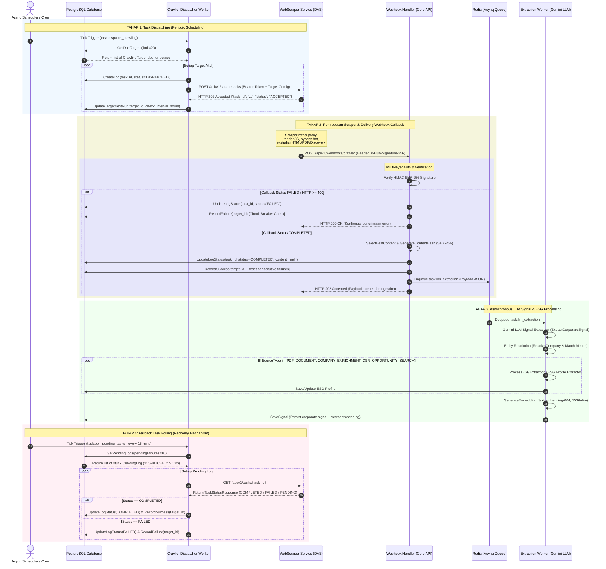

# Sequence Diagram Arsitektur Komunikasi & Orkestrasi Sovera (v2)

Dokumen ini menjelaskan diagram urutan (*sequence diagram*) keseluruhan alur komunikasi antara **Sovera Core API (Brain & Orchestrator)**, **WebScraper Service (Execution Muscle)**, **Redis (Asynq Worker Queue)**, dan **Gemini LLM Engine**.

---

## 📐 Overall Sequence Diagram (End-to-End Flow)

---

## 📌 Penjelasan Masing-Masing Tahap

### 1. **Tahap 1: Task Dispatching (Periodic Scheduling)**
* **Komponen:** Asynq Cron Scheduler, `CrawlerRepository`, `CrawlerDispatcherHandler`, WebScraper Service (DAS).
* **Alur:**
  1. Cron scheduler memicu tugas `task:dispatch_crawling` secara periodik.
  2. Dispatcher mengambil daftar situs target yang jatuh tempo dari tabel `crawling_targets` di PostgreSQL.
  3. Dispatcher mencatat log berstatus `DISPATCHED` ke tabel `crawling_logs`.
  4. Dispatcher mengirimkan request HTTP `POST /api/v1/scrape-tasks` (atau `/discovery`, `/crawl-jobs`) ke Scraper Service.
  5. Scraper Service merespons dengan `HTTP 202 Accepted` dan `task_id` tanpa menahan koneksi (*non-blocking*).

### 2. **Tahap 2: Pemrosesan Scraper & Delivery Webhook Callback**
* **Komponen:** WebScraper Service, Middleware HMAC, `WebhookHandler`, PostgreSQL, Redis Asynq.
* **Alur:**
  1. Scraper mengeksekusi ekstraksi web/PDF/discovery di background secara asinkron.
  2. Setelah selesai, Scraper menembak callback `POST /api/v1/webhooks/crawler` dengan header tanda tangan `X-Hub-Signature-256`.
  3. Middleware memverifikasi keaslian HMAC SHA-256.
  4. Jika pemindaian **Gagal**: Backend mencatat log `FAILED` dan memperbarui `consecutive_failures` pada target (Circuit Breaker).
  5. Jika pemindaian **Sukses**: Backend menghitung `content_hash`, memperbarui log `COMPLETED`, me-reset health target, dan memasukkan job ke antrean Redis `task:llm_extraction`.

### 3. **Tahap 3: Asynchronous LLM Processing & Vector Embedding**
* **Komponen:** Redis Queue, `ExtractionWorker`, Gemini Service, Entity Resolver, ESG Extractor, PostgreSQL.
* **Alur:**
  1. Worker mengambil job `task:llm_extraction` dari Redis.
  2. Gemini LLM mengekstraksi entitas bisnis, skor minat CSR (*intent score*), dan ringkasan sinyal korporasi.
  3. Entity Resolver mencocokkan nama perusahaan ke tabel master entitas (*Canonical Company Master*).
  4. Jika tipe data berupa laporan keberlanjutan, pengayaan profil (`COMPANY_ENRICHMENT`), atau hibah (`CSR_OPPORTUNITY_SEARCH`), ESG Extractor dijalankan.
  5. Model Gemini `text-embedding-004` menghasilkan vektor 1536 dimensi yang disimpan bersama sinyal ke PostgreSQL (`public_corporate_signals`).

### 4. **Tahap 4: Fallback Task Polling (Ketahanan & Recovery)**
* **Komponen:** Asynq Cron, `CrawlerRepository`, `Dispatcher`, WebScraper API.
* **Alur:**
  1. Setiap 15 menit, worker memicu `task:poll_pending_tasks`.
  2. Worker mencari log pemindaian yang menggantung di status `DISPATCHED` lebih dari 10 menit (kemungkinan callback terlepas saat CI restart/deployment).
  3. Worker menembak endpoint `GET /api/v1/tasks/{task_id}` pada Scraper Service.
  4. Jika task di Scraper sudah selesai atau gagal, backend menyinkronkan status log & health target secara otomatis.
